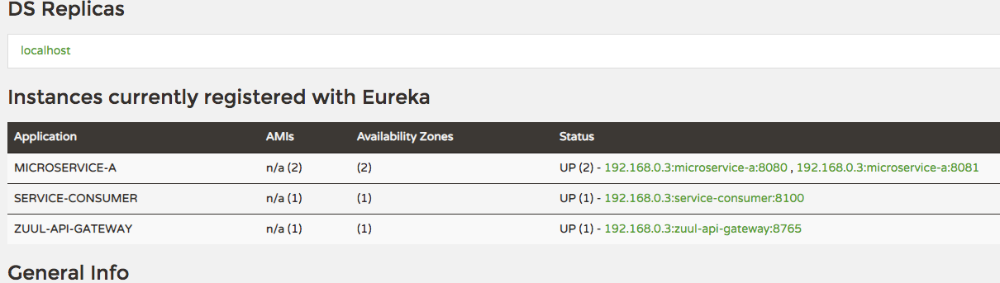
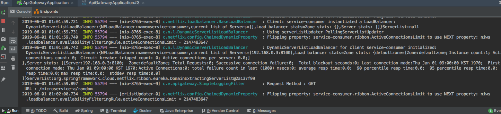

> [스프링 5.0 마스터](http://acornpub.co.kr/book/mastering-spring-5.0)를보고 정리한 자료 입니다.

# API 게이트웨이

## 마이크로 서비스의 문제점 
* 인증, 권한 부여 및 보안 : 모놀리식 서버에서는 인증 인가를 한 서버에서 책임지면 되는데 여러 서비스가 존재하는 마이크로서비스에서는 올바른 엑세스 보장을 어떻게할 것인가?
* 동적 라우팅은 어떻게 할 것인가?
* 내결합성: 하나의 마이크로서비스에서 오류가 발생해도 전체 시스템이 중단되지 않도록하면 어떻게 해야하는가 ?

이러한 문제는 마이크로서비스가 서로 직접 대화할 때 개별 마이크로서비스에 의해 해결돼야한다. **하지만 이런 아키텍처들은 위 우려들을 각 마이크로서비스가 다르게 처리할 수 있기 때문에 유지 관리가 어려울 수 있다.**

이려한 문제를 해결하기 가장 쉬운 것이 API 게이트웨이이다. 다음은 API 게이트가 제공하는 기능이다.

* 인증 및 보안
* 속도 제한
* 모니터링
* 동적 라우팅 및 정적 응답 처리
* 로드 차단
* 여러 가지 서비스의 응답 집계


## 주울로 클라이언트 - 사이드 로드 밸런싱 구현
주을은 스프링 클라우드 넷플릭스 프로젝트의 일부다. 동적 라우팅, 모니터링, 필터링, 보안 등의 기능을 제공하는 API 게이트웨이 서비스다.

```
dependencies {
    implementation 'org.springframework.cloud:spring-cloud-starter-netflix-eureka-client'
    implementation 'org.springframework.cloud:spring-cloud-starter-netflix-zuul'
}
```

```java
@EnableZuulProxy
@EnableDiscoveryClient
@SpringBootApplication
public class ApiGatewayApplication {

  public static void main(String[] args) {
    SpringApplication.run(ApiGatewayApplication.class, args);
  }

}
```

```yml
spring:
  application:
    name: "zuul-api-gateway"


eureka:
  client:
    service-url:
      defaultZone: http://localhost:8761/eureka

server:
  port: 8765

```

필요한 의존성, 유레카 클라이언트, API 게이트웨이 등록을 진행한다.


서버를 실행하면 유레카에 등록된 것을 확인 할 수있다.

```java
@Component
@Slf4j
public class SimpleLoggingFilter extends ZuulFilter {
  
  @Override
  public String filterType() {
    return "pre"; // pre 사전 필터, route 원본으로 라우팅하기, post필터를 포스트라우팅, error 에러 처리
  }

  @Override
  public int filterOrder() {
    return 1; // 필터 우선순위
  }


  @Override
  public boolean shouldFilter() {
    return true; // 조건에 따른 필터 동작 여부, 해당 코드에서는 동작하기 위해서 true 리턴
  }
  
  @Override
  public Object run() { // 필터에 대한 로직을 구현하는 방식, 아래 예제는 단순하게 로깅용
    final RequestContext context = RequestContext.getCurrentContext();
    final HttpServletRequest request = context.getRequest();

    log.info(MessageFormat
        .format("Request Method : {0} \n URL : {1} ", request.getMethod(),
            request.getRequestURI()));
    return null;
  }
}
```


```
GET http://127.0.0.1:8765/microservice-a/random
Accept: application/json

GET http://127.0.0.1:8765/service-consumer/add
Accept: application/json
```
service-name/url 을 호출할 경우 유레카에 등록되있는 서비스 정보를 기반으로 호출하게된다.


`SimpleLoggingFilter` 잘 동작하는지 확인할 수 있다.


## 필터
* 사전 필터: 주울에서 목표 대상에 대한 실제 요청이 발생하기 전에 호출된다. 일반적으로 사전 필터는 서비스의 일관된 메세지형식(HTTP 헤더의 포함여부)을 확이하는 작업을 수행하거나 서비스를 이용하는 사용자가 인증 및 인가되었는지 확인하는 게이이트키퍼 역할을 한다.
* 사후 필터: 대상 서비스를 호추랗고 응답을 클라이언트로 전송한 후 호출된다. 일반적으로 사후 필터는 대상 서비스의 응답을 로깅하거나 에러 처리, 민감정보에 대한 응답을 감시하는 목적으로 구현된다.
* 경로 필터: 대상 서비스가 호출되기 전에 호출을 가로체는 데 사용된다. 일반적으로 경로 필터는 일정 수준의 동적 라우팅 필요 여부를 결정하는 데 사용된다. 예를 들어 이 장 뒷부분에서 동일 서비스의 다른 두 버전을 라우팅할 수 있는 경로 단위 핉를 사용해 작은 호출 비율만 새 버전의 서비스로 라우팅할 수 있다.

### 필터 적용 패턴
* TrackingFilter: 주울에서 보내는 모든 요청에 연관된 상관관계 ID 여부를 확인하는 사전 필터다, 상관관계 ID는 고객 요청을 수행할 때 실행할 때 실행되는 모든 마이크로서비스에 전달되는 고유 ID이다. 상관관계 ID를 사용하면 특정 호출이 일련의 마이크로서비스를 통과할 때 발생하는 모든 이벤트 체인을 추적할 수 있다.
* SpecialRoutesFilter: 유입되는 경로를 확인하고 해당 경로에 A/B 테스팅 수행 여부를 결정하는 주울의 경로 필터다. 
* ResponseFilter: 서비스 호출과 연관된 상관관계 ID를 클라이언트 회신하는 HTTP 응답 헤더에 삽입하는 사후 필터다. 일반적으로 클라이언트는 호출한 요청과 연관된 상관관계 ID에 엑세스할 수 있다.