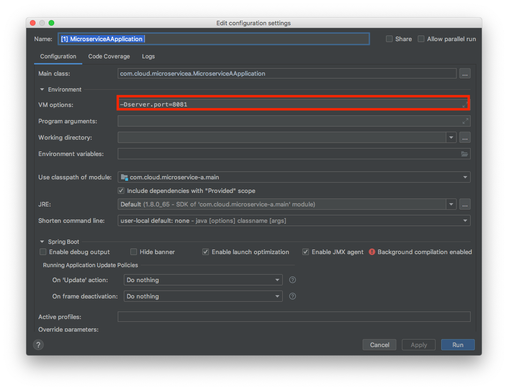
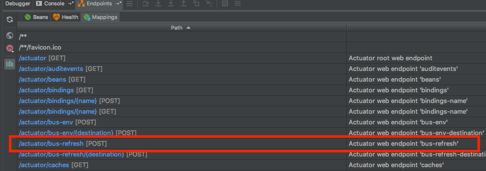

> [스프링 5.0 마스터](http://acornpub.co.kr/book/mastering-spring-5.0)를보고 정리한 자료 입니다.

# Spring Cloud Bus

프로덕션 환경에서 실행중인 마이크로서비스 A의 인스턴스가 N대가 있을 경우에는 설정을 변경하기 위해서는 `POST http://127.0.0.1:8080/actuator/refresh` 요청을 N대의 인스턴스 서버에 N번의 refresh API를 호출 해야한다. 이는 번거러울 뿐만 아니라 실수를 유발하기 쉬운 구조이다.


## 스프링 클라우드 버스를 시용한 변경 전파


스프링 클라우 버스를 사용해서 Rabbit MQ 같은 메시지 브로커를 통해 변경 사항을 여러 인스턴스에 전달할 수 있다.

각 마이크로서비스의 인스턴스는 애플리케이션 구동시에 스프링 클라우드 버스에 등록한다. 마이크로서비스의 인스턴스 중 하나에 refresh가 호출되면 스프링 클라우드 버스는 모든 마이크로서비스 인스턴스에 변경 이벤트를 전달하게 된다. 


## Rabbit MQ 설치

```
.
├── config-server
├── docker-compose.yaml
├── microservice-a
├── microservice-a-default.yml
├── microservice-a-dev.yml
├── service-consumer
├── static
└── volumes
```
프로젝트 루트 디렉토리에 volumes 디렉토리를 만들고, gitginore를 추가 해줍니다. 해당 디렉토리에 docker rabbmit mq가 저장됩니다.


`docker-compose.yaml`  파일은 아래와 같이 준비 해줍니다.

```yaml
version: "3"

services:
  rabbitmq:
    container_name: bus.rabbitmq
    image: rabbitmq:3.7-management
    ports:
      - "5672:5672"
      - "15672:15672"
    environment:
      - RABBITMQ_DEFAULT_USER = user
      - RABBITMQ_DEFAULT_PASS = user
    hostname: bus
    volumes:
      - ./volumes/bus-rabbitmq:/var/lib/rabbitmq
```


```
$ cd 프로젝트 루트 디렉토리
$ docker-compose -up -d
```

## Client
```gradle
dependencies {
    implementation 'org.springframework.cloud:spring-cloud-starter-bus-amqp'
}
```
필요한 의존성을 추가합니다.


서버가 시작될때 스프링 클라우드 버스에 등록되고, 클라우드 버스의 이벤트를 수신하게 됩니다. Rabbmit MQ 컨넥션은 자동으로 연결됩니다. (스프링 너란 자식....)




포트를 8080, 8081을 설정해서 2대의 서버를 구동 시킵니다.


## Bus Refresh


`microservice-a-default.yml`을 아래처럼 변경합니다.

```yml
application:
  message: "Message From Default Local Git Repository (Spring Cloud Bus)"
```

`/bus/refresh` API가 추가되 었습니다. 해당 API를 호출합니다. (8081을 호출해도 됩니다.)

```curl
curl -X POST http://localhost:8080/bus/refresh
```

refresh 호출 이후에 message를 호출합니다.


```curl
curl -X GET http://localhost:8081/message
```
8080 refresh를 호출하더라도 다른 8081 서버도 반영되는 것을 확인할 수 있습니다.

