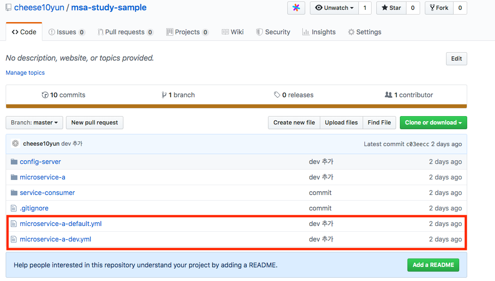
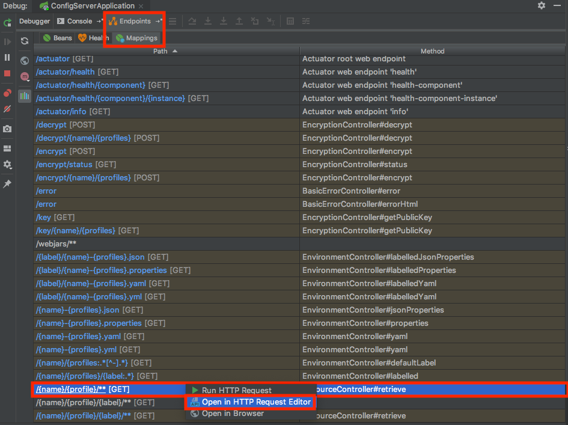
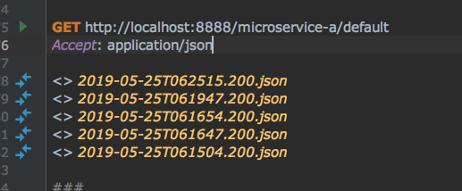
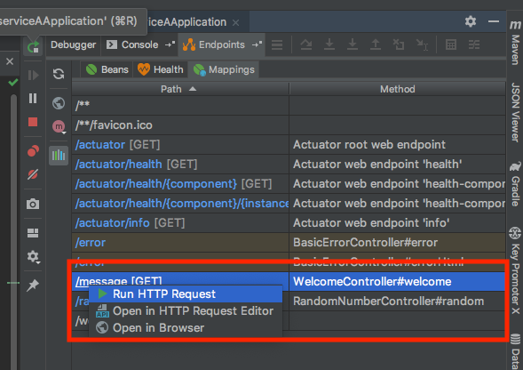

> [스프링 5.0 마스터](http://acornpub.co.kr/book/mastering-spring-5.0)를보고 정리한 자료 입니다.

# 스프링 클라우드 컨피그
스프링 클라우드 컨피그는 중앙 집중식 마이크로서비스 구성을 지원한다. 여기서 두 가지 중요한 구성 요소의 조합이다.

* 스프링 클라우드 컨피그 서버 : 버전 관리 리포지토리로 백업된 중앙 집중식 구성 노출을 지원한다.
* 스프링 클라우드 컨피그 클라이언트 : 애플리케이션이 스프링 클라우드 컨피그 서버에 연결하도록 지원한다.


## GitHub Repository 연결


GitHub Repository에 
* micoroservice-a-default.yml
* micoroservice-a-dev.yml

아래 처럼 작성합니다.

```yml
application:
  message: "Message From {ENV} Local Git Repository"
```
`{ENV}`에 ddefault, dev 환경에 맞는 값을 작성합니다.


## Config Server 


```gradle
implementation 'org.springframework.cloud:spring-cloud-config-server'
implementation 'org.springframework.boot:spring-boot-starter-actuator'
```
config server 의존 성을 추가합니다. actuator도 편의를 위해서 추가합니다.

```yml
server:
  port: 8888

spring:
  application:
    name: "config-server"

  cloud:
    config:
      server:
        git:
          uri: "https://github.com/cheese10yun/msa-study-sample"

```

config server는 8888 port를 사용하는 관례가 있어 port를 8888로 지정합니다. Github Repository URI 주소를 입력합니다.


```java
@SpringBootApplication
@EnableConfigServer
public class ConfigServerApplication {

  public static void main(String[] args) {
    SpringApplication.run(ConfigServerApplication.class, args);
  }

}
```
`@EnableConfigServer` 어노테이션을 추가만 하면 별다른 설정없이 Config Server가 설정됩니다. 


actuator 의존성이 있으면 IntellJ Endpoints -> Mappings에서 현재 서버의 API mapping 정보를 쉽게 확인할 수 있습니다.


마우스 왼쪽 클릭을 한 이후에 Open In Http Request...를 클릭하면 쉽게 HTTP 콜을 할 수 있습니다.



URL 형식은 /{appliation-name}/{profile}/{label}입니다. 위에서 등록한 `micoroservice-a-default.yml`을 확인해보기 위해서 `http://localhost:8888/microservice-a/default`을 호출합니다.


```json
{
  "name": "microservice-a",
  "profiles": [
    "default"
  ],
  "label": null,
  "version": "c03eecc5d8eabefc4b2a8f085789f42bd5317366",
  "state": null,
  "propertySources": [
    {
      "name": "https://github.com/cheese10yun/msa-study-sample/microservice-a-default.yml",
      "source": {
        "application.message": "Message From Default Local Git Repository"
      }
    }
  ]
}
```
응답 값을 보면 해당 properties를 잘 읽어 오는 것을 확인할 수 있습니다. 

`http://localhost:8888/microservice-a/dev`을 호출하면 `micoroservice-a-dev.yml`의 값을 제대로 읽어 오는지 확인할 수 있습니다.

```json
{
  "name": "microservice-a",
  "profiles": [
    "dev"
  ],
  "label": null,
  "version": "c03eecc5d8eabefc4b2a8f085789f42bd5317366",
  "state": null,
  "propertySources": [
    {
      "name": "https://github.com/cheese10yun/msa-study-sample/microservice-a-dev.yml",
      "source": {
        "application.message": "Message From Default Dev Git Repository"
      }
    }
  ]
}
```

## Client

```gradle
dependencies {
    implementation 'org.springframework.cloud:spring-cloud-config-client'
    implementation 'org.springframework.boot:spring-boot-starter-actuator'
}
```
필요한 의존성을 추가합니다.


```java
@Component
@ConfigurationProperties("application")
@Getter
@Setter
public class ApplicationConfiguration {

  private String message;

}

```
프로퍼티를 읽을 ConfigurationProperties 객체를 만듭니다.


```java
@RestController
@RequiredArgsConstructor
public class WelcomeController {

  private final ApplicationConfiguration applicationConfiguration;


  @GetMapping("/message")
  public Map<String, String> welcome() {

    final Map<String, String> map = new HashMap<>();
    map.put("message", applicationConfiguration.getMessage());

    return map;
  }
}
```
해당 메시지를 확인할 수 있는 컨트롤러를 만듭니다. `getMessage()` 메시지는 각 환경마다 다른 메시지를 출력합니다.

```yml
spring:

  profiles:
    active: {ENV}

  cloud:
    config:
      uri: http://localhost:8888
  application:
    name: microservice-a

```
파일명은 `bootstrap.yml`으로 지정합니다. `active`는 각 환경마다 지정합니다. dev으로 지정하고 `http://127.0.0.1:8080/message` API를 호출해보겠습니다.



이것도 인텔리제이를 이용해서 호출하면 간편합니다.


```json
{
  "message": "Message From Default Dev Git Repository"
}
```

`Dev` 메시지가 출력되는 것을 확인 할 수 있습니다. `profiles`을 `default` 으로 지정하면 메시지에는 local 이라는 문자가 출력됩니다.

## 결론
Github Repository와 같은 버전 관리 리포지토리로 백업된 중앙 집중 구성으로 properties를 제공해줍니다. 또 Properties 설정 및 단순한 설정으로 클라이언트 애플리케이션이 스프링 클라우드 컨피그 서버에 쉽게 연결되도록 지원해줍니다.