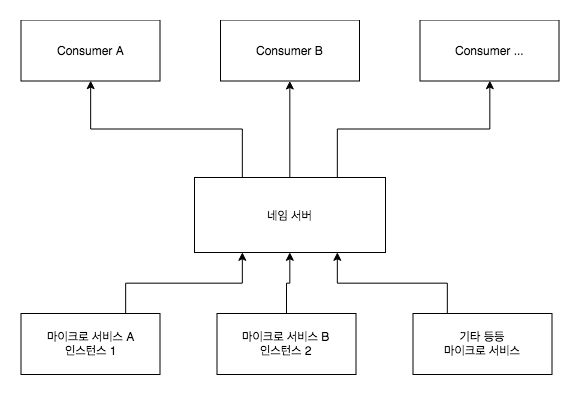

> [스프링 5.0 마스터](http://acornpub.co.kr/book/mastering-spring-5.0)를보고 정리한 자료 입니다.

# Eureka

## 네임 서버
마이크로서비스 아키텍처는 서로 상호 작용하는 더 작은 마이크로서비스가 필요 하다. 이 밖에도 각 마이크로서비스의 인스턴스가 여러 개 있을 수 있다. 마이크로서비스의 새로운 인스턴스가 동적으로 생성되고 파괴되면 외부 서비스의 연결 및 구성을 수동으로 유지하는 것이 어려울 수 있다. **네임 서버는 서비스 등록 및 서비스 검색 기능을 제공한다.** 네임 서버는 마이크서비스가 이들 자신을 등록할 수 있게 하고, 상호 작용하고자 하는 다른 마이크러서비스에 대한 URL을 찾을 수 있게 도와준다.

## URL 하드 코딩의 한계

```yml
microservice-a:
  ribbon:
    listOfServers: http://localhost:8080,http://localhost:8081
```
* 마이크로서비스 A의 새 인스턴스가 생성된다.
* 마이크로서비스 A의 기존 인스턴스는 더 이상 사용할 수 없다.
* 마이크로서비스 A가 다른 서버로 이동됐다.

이런 모든 경우에 구성을 업데이트해야 하며, 변경 사항을 적용하기 위해서는 마이크로서비스가 새로 고쳐져야 한다.

## 네임 서버 작동



* **모든 마이크로서비스는 각 마이크로서비스가 시작될때 네임 서버에 등록한다.**
* 서비스 소비자가 특정 마이크로 서비스의 위치를 얻으려면 네임 서버를 요청해야한다.
* 고유한 마이크로서비스 ID가 각 마이크로서비스에 지정된다. 이것을 등록 요청 및 검색 요청에서 키로 사용된다.
* 마이크로서비스는 자동으로 등록 및 등록 취소할 수 있다.
* 서비스 소비자가 마이크로서비스ID로 네임 서버를 찾을 때마다 해당 특정 마이크로서비스의 인스턴스 목록을 가져온다.