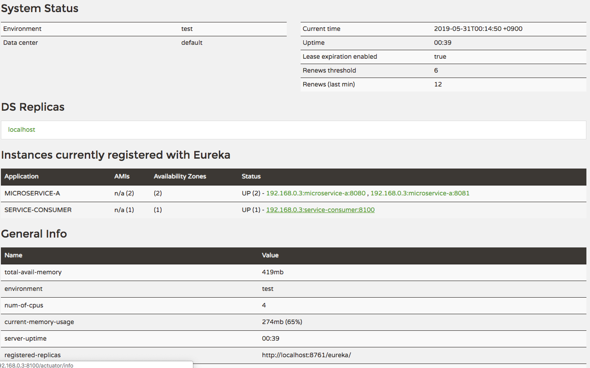

> [스프링 5.0 마스터](http://acornpub.co.kr/book/mastering-spring-5.0)를보고 정리한 자료 입니다.

# Eureka

## 네임 서버
마이크로서비스 아키텍처는 서로 상호 작용하는 더 작은 마이크로서비스가 필요 하다. 이 밖에도 각 마이크로서비스의 인스턴스가 여러 개 있을 수 있다. 마이크로서비스의 새로운 인스턴스가 동적으로 생성되고 파괴되면 외부 서비스의 연결 및 구성을 수동으로 유지하는 것이 어려울 수 있다. **네임 서버는 서비스 등록 및 서비스 검색 기능을 제공한다.** 네임 서버는 마이크서비스가 이들 자신을 등록할 수 있게 하고, 상호 작용하고자 하는 다른 마이크러서비스에 대한 URL을 찾을 수 있게 도와준다.

## URL 하드 코딩의 한계

```yml
microservice-a:
  ribbon:
    listOfServers: http://localhost:8080,http://localhost:8081
```
* 마이크로서비스 A의 새 인스턴스가 생성된다.
* 마이크로서비스 A의 기존 인스턴스는 더 이상 사용할 수 없다.
* 마이크로서비스 A가 다른 서버로 이동됐다.

이런 모든 경우에 구성을 업데이트해야 하며, 변경 사항을 적용하기 위해서는 마이크로서비스가 새로 고쳐져야 한다.

## 네임 서버 작동


* **모든 마이크로서비스는 각 마이크로서비스가 시작될때 네임 서버에 등록한다.**
* 서비스 소비자가 특정 마이크로 서비스의 위치를 얻으려면 네임 서버를 요청해야한다.
* 고유한 마이크로서비스 ID가 각 마이크로서비스에 지정된다. 이것을 등록 요청 및 검색 요청에서 키로 사용된다.
* 마이크로서비스는 자동으로 등록 및 등록 취소할 수 있다.
* 서비스 소비자가 마이크로서비스ID로 네임 서버를 찾을 때마다 해당 특정 마이크로서비스의 인스턴스 목록을 가져온다.


## 구현

### 유레카 서버 설정


```
dependencies {
    implementation 'org.springframework.cloud:spring-cloud-starter-netflix-eureka-client'
}
```
* 필요한 디펜던시를 추가합니다.

```java

@SpringBootApplication
@EnableEurekaServer
public class EurekaServerApplication {

  public static void main(String[] args) {
    SpringApplication.run(EurekaServerApplication.class, args);
  }
}
```

```yml
server:
  port: 8761

eureka:
  client:
    fetch-registry: false
    register-with-eureka: false
```

### 유레카 마이크로 서비스 등록
기존에 서비스들을 유레카 서버에게 접속할 수있도록 서비스 등록 작업을 진행합니다.

```
dependencies {
    implementation 'org.springframework.cloud:spring-cloud-starter-netflix-eureka-client'
}
```

```java
@SpringBootApplication
@EnableDiscoveryClient
public class MicroserviceAApplication {

  public static void main(String[] args) {
    SpringApplication.run(MicroserviceAApplication.class, args);
  }

}
```
의존성 추가 및 `@EnableDiscoveryClient` 어노테이션 추가합니다. 

### 유레카와 마이크로 서비스 연결


```yml
#microservice-a:
#  ribbon:
#    listOfServers: http://localhost:8080,http://localhost:8081
```

```java
@SpringBootApplication
@EnableFeignClients("com.cloud.serviceconsumer") // 어노테이션 추가
@EnableDiscoveryClient
public class ServiceConsumerApplication {

  public static void main(String[] args) {
    SpringApplication.run(ServiceConsumerApplication.class, args);
  }

}
```

마이크로서비스A의 URL을 하드 코딩했을 경우 추가적인 서버 증성작업이 어렵다. 서비스 소비자 마이크로서비스가 유레카 서비스로부터 URL을 알아낼 수 있어야한다. 하드코딩된 URL정보를 주석처리 하고 아래의 어노테이션을 추가하면 된다.


```java
@FeignClient(name = "microservice-a")
@RibbonClient(name = "microservice-a")
public interface RandomServiceProxy {

  @GetMapping("/random")
  List<Integer> getRandomNumbers();
}
```

### 동작 순서
1. 마이크로서비스 A의 각 인스턴스가 시작되면 유레카 네임 서버에 등록한다.
2. 서비스 소비자 마이크로서비스는 마이크로서비스 A의 인스턴스ㅔ 대해 유레카 네임 서버를 요청한다.
3. 서비스 소비자 마이크로서비스는 립본 클라이언트-클라이언트 로드 밸런서를 사용해 소출할 마이크로서비스 A의 특정 인스턴스를 결정한다.
4. 서비스 소비자 마이크로서비스는 마이크로서비스 A의 특정 인스턴스를 호출한다.

유레카의 가장 큰 장점은 서비스 소비자 마이크로서비스가 마이크로서비스 A와 분리된다는 것이다. 서비스 소비자 마이크로서비스는 마이크로서비스 A의 새로운 인스턴스가 나타나거나 기존 인스턴스가 디운될 때마다 재구성할 필요가 없다.



유레카 데시보드에서 여러 마이크로서비스를 확인 할 수 있다.