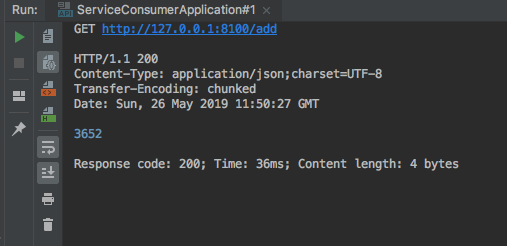

> [스프링 5.0 마스터](http://acornpub.co.kr/book/mastering-spring-5.0)를보고 정리한 자료 입니다.

# 선언적 Rest 클라이언트 - Feign

페인은 최소한의 구성과 코드로, REST 서비스를 위한 REST 클라이언트를 쉽게 작성할 수 있습니다. 간단한 인터페이스로, 적절한 어노테이션을 사용하는 것이 특징입니다. 

페인은 립본 및 유레카와 통합하여 사용하면 더욱 효율성이 높아지게 됩니다.


```gradle
dependencies {
    implementation 'org.springframework.cloud:spring-cloud-starter-openfeign'
}
```
필요한 의존성을 추가합니다.

```java
@FeignClient(name = "micoservice-a", url = "localhost:8080")
public interface RandomServiceProxy {

  @GetMapping("/random")
  public List<Integer> getRandomNumbers();
}
```
* 서비스의 이름과 URL을 하드코딩 합니다. (유레카를 통해서 하드코딩된 부분을 제거할 수 있습니다.)
* Controller 코드를 작성하듯이 작성합니다.
* 중요한 것은 이것은 인터페이스이며, 적절한 어노테이션 기반으로 동작한다는 것입니다.


```java

@RestController
@Slf4j
@RequiredArgsConstructor
public class NumberAddController {

  private final RandomServiceProxy randomServiceProxy;

  @GetMapping("/add")
  public Long add() {
    final List<Integer> numbers = randomServiceProxy.getRandomNumbers();
    final long sum = numbers.stream().mapToInt(number -> number).asLongStream().sum();
    log.warn("returning " + sum);
    return sum;
  }
}

```
* RandomServiceProxy 의존성을 받아 사용합니다.


Feign 응답값을 확인할 수 있습니다.