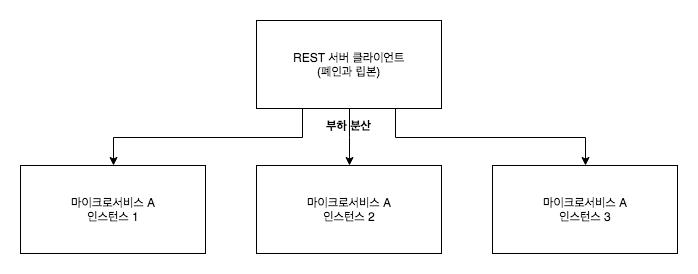
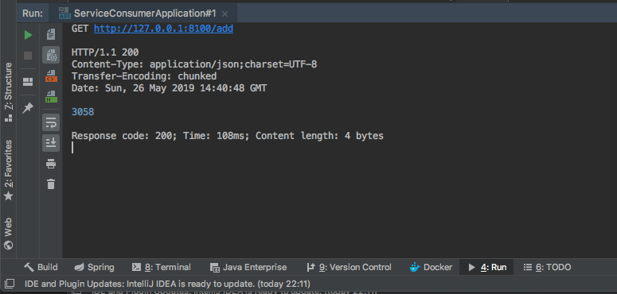
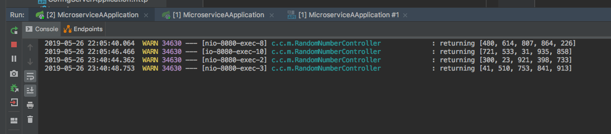
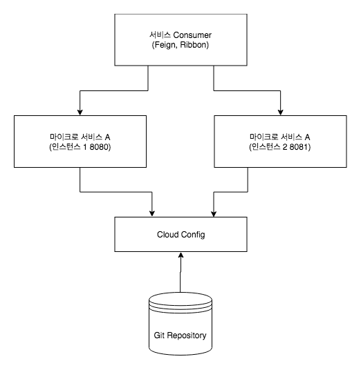

> [스프링 5.0 마스터](http://acornpub.co.kr/book/mastering-spring-5.0)를보고 정리한 자료 입니다.

# Ribbon

## 로드 밸런싱
마이크로서비스는 클라우드-네이티브 아키텍처의 가장 중요한 빌딩 블록이다. 마이크로서비스 인스턴스는 특정 마이크로서비스의 로드에 따라 확대 및 축소된다. 부하가 마이크로서비스의 다른 인스턴스 간에 똑같이 분산되도록 하려면 로드밸런싱의 기술피 필수이다. 로드 밸런싱은 로드가 마이크로서비스의 다른 인스턴스간에 균등하게 분배하도록 도와준다.

## Ribbon 구성


스프링 클라우드 넷플릭스 립본은 마이크로서비스의 다른 인스턴스 간에 라운드 로빈 실행을 사용해 **클라이언트-사이드 로드 밸런싱을 제공한다.**

```gradle
dependencies {
    implementation 'org.springframework.cloud:spring-cloud-starter-netflix-ribbon'
}
```
필요한 의존성을 추가 합니다.

```java
@FeignClient(name = "microservice-a")
@RibbonClient(name = "microservice-a")
public interface RandomServiceProxy {

  @GetMapping("/random")
  List<Integer> getRandomNumbers();

}

```
기존에 작성했던 RandomServiceProxy 인터페이스를 위와 같이 작성합니다. `FeignClient`도 서비스 네임만 기술합니다.

```yml
microservice-a:
  ribbon:
    listOfServers: http://localhost:8080,http://localhost:8081
```
`microservice-a`의 서비스 url을 입력합니다.



GET http://127.0.0.1:8100/add을 호추랗면 아래와 같은 결과값을 응답 받습니다.




라운드 로빈 방식으로 random API 호출이 http://localhost:8080, http://localhost:8081으로 분산되어 호출됩니다.



위과 같은 아키텍처 구성을 가지게 됩니다.